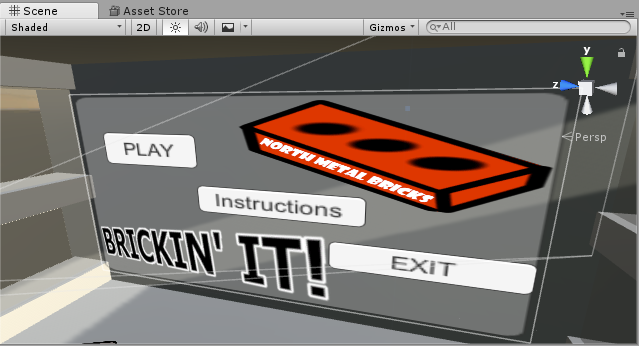
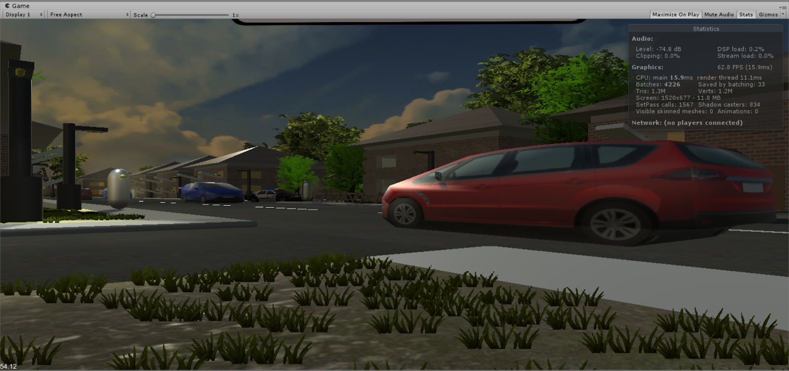
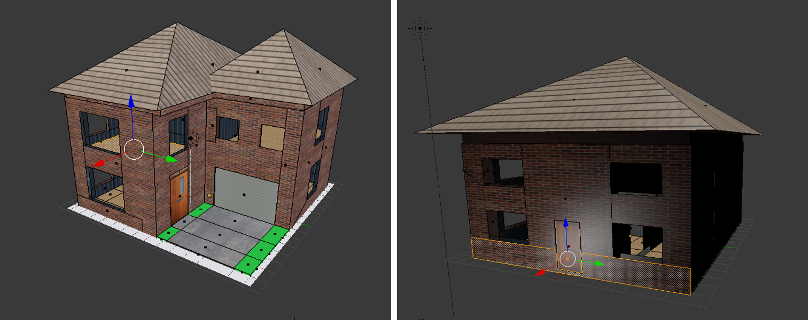

# BrickinIT, A VR game about vandalism.

This project was a team effort by me and three others to create a VR game in Unity using the MIDDLE-VR Library to which allowed us to target both the HTC-VIVE and the C.A.V.E VR systems within the UK.

This game is based off a arcade-like vandalism simulation where you smash windows for points, avoid A.I police and avoid getting ran over by cars.

## Sample Screenshots

